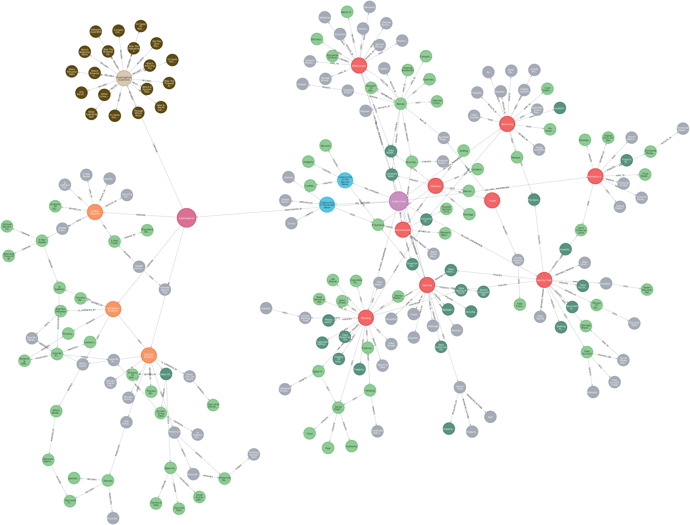

# graph/

Dieser Ordner enthält alle Ressourcen zum Knowledge Graph des Projekts *Case2Report*, einschließlich Visualisierung, Cypher-Abfrage und JSON-Datenexport.

## Überblick

Der Graph bildet zentrale Konzepte im Bereich der Cyberkriminalität ab:

- Phänomene: z. B. Phishing, Ransomware, DDoS-Angriffe
- Kategorisierung: Einteilung in Cybercrime im engeren bzw. weiteren Sinne
- Ermittlungsansätze: forensische Maßnahmen, Analysewege
- Verknüpfungen: semantische Relationen zwischen Entitäten

## Visualisierung

Diese Darstellung zeigt exemplarisch die Struktur des Graphen: von der übergeordneten Kategorie „Cybercrime“ bis zu konkreten Phänomenen und Ermittlungsstrategien.

## Dateien in diesem Ordner

| Datei                        | Beschreibung                                                                 |
|-----------------------------|------------------------------------------------------------------------------|
| `graph.svg`                 | Bildliche Darstellung des zentralen Knowledge Graph (Visual Export)         |
| `graph.json`                | JSON-Export des gesamten Graphen (Knoten, Kanten, Attribute)                |
| `case2report_query.cypher`  | Zentrale Cypher-Abfrage zur semantischen Auswertung und Kontextextraktion   |

## graph.json

Diese Datei enthält eine strukturierte JSON-Repräsentation des gesamten Knowledge Graphs. Sie dient zur:

- Weiterverarbeitung im LLM (z. B. als Kontextinput)
- Analyse und Debugging außerhalb von Neo4j
- Integration in Visualisierungs- oder Auswertungstools

Der Export enthält typischerweise:

- `nodes`: Liste aller Entitäten inkl. Labels und Properties
- `relationships`: Alle Relationen mit Start- und Endknoten, Typ und Attributen

## case2report_query.cypher

Diese Abfrage ist Teil der RAG-Pipeline und erfüllt folgende Aufgaben:

1. Nutzt OpenAI Embeddings, um das relevanteste Phänomen sowie passende Ermittlungsmaßnahmen zu identifizieren
2. Traversiert den Graphen über relevante Relationen bis zu definierter Tiefe
3. Gibt strukturierte JSON-Ausgaben zurück, die direkt vom LLM genutzt werden können

Die Abfrage wird im zentralen Analysemodul `opt_police_KG_LLM.ipynb` verwendet.

## Technische Voraussetzungen

- Neo4j (ab Version 5)
- APOC Plugin (aktiviert)
- Graph Data Science Library
- OpenAI API-Key für Embedding-Funktionen

## Nutzungshinweise

Für den Import von `graph.json` in Neo4j:
- Mittels APOC: `CALL apoc.import.json("file:///graph.json")`
- In Python: mit `json.load()` und einer Weiterverarbeitung über `networkx`, `neo4j-driver` oder `pyvis`

## Bezug zur Bachelorarbeit

Dieser Graph wurde im Rahmen der Bachelorarbeit

**„Generative KI als Werkzeug zur Optimierung von Ermittlungsprozessen“**  
von *Oliver P.* (DHBW Heilbronn, 2025)  
in Zusammenarbeit mit dem Landeskriminalamt Baden-Württemberg

erstellt und dokumentiert.

